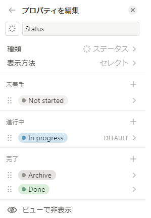

# Notion自動Status更新機能

## Todo

 - [ ] Zenn記事作成

## これは何？

NotionのStatusでDoneになって最終更新から三日後に自動でArchiveというステータスに変更する物になります。

## 設計
GithubActionを利用して`scheduled.yml`で一日に一回実行するように設定しています。

`main.py`でNotionのAPIを利用して、DoneのStatusを取得して、最終更新から三日以上経過しているものをArchiveにアップデートしています。
